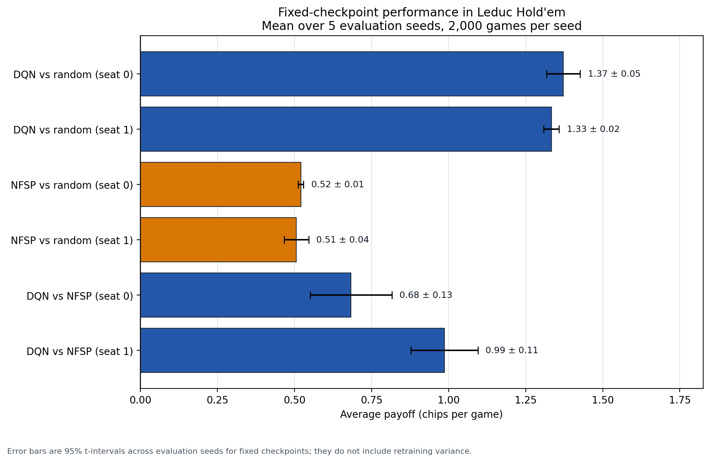
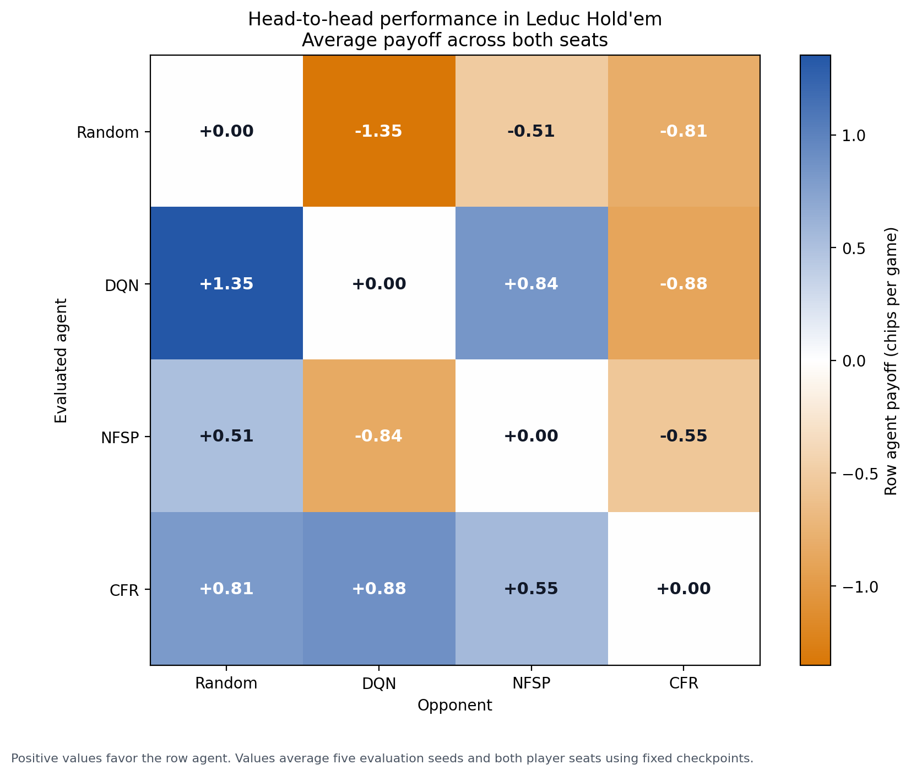

# Poker Reinforcement Learning

A reinforcement-learning project for studying decision-making in imperfect-information games using Leduc Hold'em.

The project compares a Deep Q-Network (DQN) trained against a random opponent with Neural Fictitious Self-Play (NFSP) agents trained against each other.

## Current Results

| Experiment | Average payoff |
|---|---:|
| DQN vs random, first seat | +1.3128 |
| DQN vs random, second seat | +1.3568 |
| DQN vs random, both seats | +1.3348 |
| NFSP player 0 vs random | +0.6480 |
| NFSP player 1 vs random | +0.7002 |
| DQN vs initial NFSP | approximately +0.55 |

Positive payoff means the listed agent won chips on average.

These are fixed-checkpoint evaluation results. The intervals measure evaluation-seed variation, not retraining variance, and exploitability has not yet been measured.



See [RESULTS.md](RESULTS.md) for the complete methodology, numerical results, and limitations.

### Head-to-Head Comparison



Positive cells favor the row agent. CFR defeated DQN and NFSP despite earning less than DQN against random play, demonstrating the difference between exploiting weak opponents and learning a robust strategy.

## Features

- Leduc Hold'em simulation through RLCard
- DQN training against random play
- NFSP self-play training
- Evaluation from both player positions
- Head-to-head model comparison
- Terminal interface for playing against a trained model
- Local model checkpoints excluded from Git

## Setup

Create and activate a virtual environment:

```bash
python3 -m venv .venv
source .venv/bin/activate
```

Install the dependencies:

```bash
python -m pip install -r requirements.txt
```

## Commands

Train the DQN:

```bash
python main.py
```

Evaluate the DQN from both seats:

```bash
python evaluate.py
```

Train NFSP agents through self-play:

```bash
python train_self_play.py
```

Continue NFSP training:

```bash
python continue_self_play.py
```

Compare DQN and NFSP:

```bash
python compare_models.py
```

Play against the trained DQN:

```bash
python play.py
```

## Research Roadmap

- Create a reproducible experiment runner
- Add CFR as a game-theoretic baseline
- Run experiments across multiple random seeds
- Calculate confidence intervals and learning curves
- Measure exploitability
- Test adaptive opponent-pool training
- Conduct ablation studies
- Produce a paper-style report

## Limitations

The current agents play simplified Leduc Hold'em rather than full Texas Hold'em. Performance against random opponents does not establish optimal or generally strong poker play. The current results should be treated as an early experimental baseline.